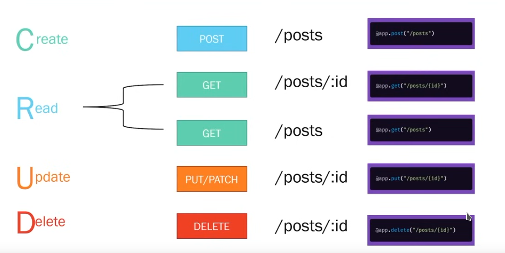

# CRUD

CRUD é um acrônimo que representa as quatro operações principais de uma aplicação (**Create**, **Read**, **Update** e **Delete**).

No contexto de uma API para uma rede social, a API deve ser capaz de:

- Permitir a um usuário criar uma publicação.

- Retornar o conteudo de uma determinada publicação de um algum usuário ou várioas publicações de usuário diferentes ou não.

- Atualizar o conteudo de uma publicação específica.

- Deleter/Remover uma publicação.

# Nomeação dos paths usados

Como a API permite a criação, leitura, atualização e remoção de publicações em uma rede social, faz sentido que se use a palavra posts (no plural) para preceder todas as operações realizadas pela API. A nomeção e padrão utilizado na url das requisições devem ser padronizadas e escolhidas de forma que reflitam suas ações.
